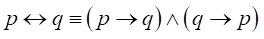
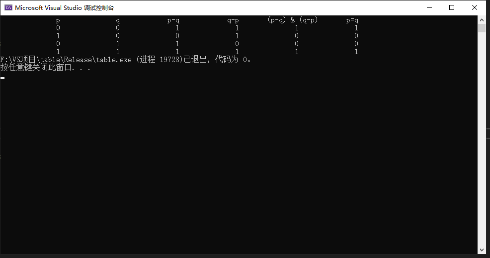

# 功能
## Proposition类
实现了**非**、**合取**、**析取**、**蕴含**、**当且仅当**一系列操作  

## truetable类
1.实现了打印多个单个命题变元的真值（使用穷举法实现）  

sample：
|p|q|
|:----:|:----:|
|1|1|
|1|0|
|0|1|
|0|0|

2.命题变元式子的由中缀表达式转换为后缀表达式  
3.将后缀表达式求出真值  

# 题目
>- 充要条件是我们初中学习过的知识。p是q的充要条件，是指由p能推出q，同时由q也能推出p。充要条件还有一个称谓，即“p当且仅当q”。在数理逻辑中，专门为充要条件发明了一个运算符“↔”，即p↔q；也为“推出”（如果，那么）发明了一个运算符“→”。不管是“↔”，还是“→”，在数理逻辑中，都有专门的定义。请从数理逻辑的角度，证明以下两个复合命题等价，体验一下数理逻辑这套知识体系，不与我们的推理常识（充要条件）矛盾：

# 运行结果
