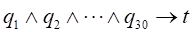
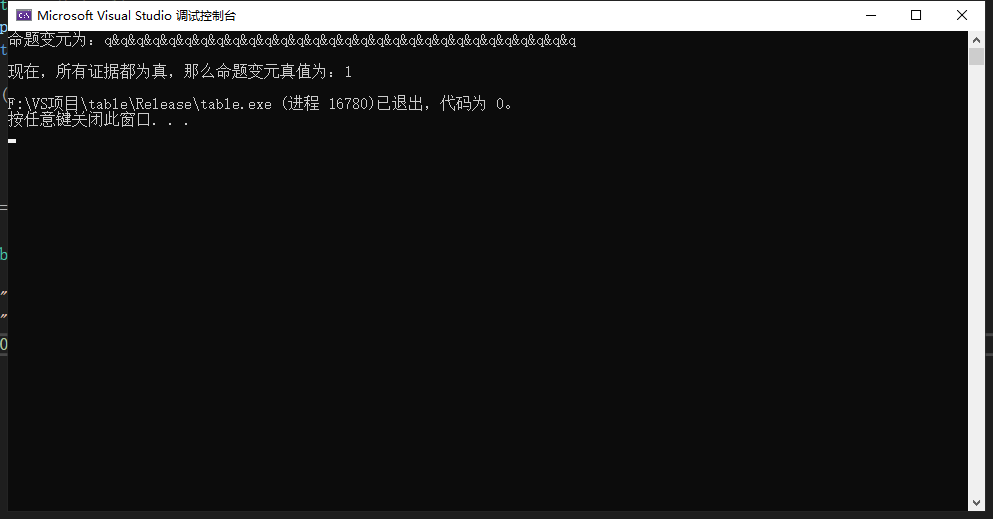

# 题目
>- 警察需要侦破某重大杀人案件，已抓获一嫌疑人，并且搜集了与该嫌疑人30项有关的证据。这30项证据之间有千丝万缕的联系。任何证据之间都不能互相矛盾，要一致地推出嫌疑人有罪，才能定案。但是要理清这些证据是否矛盾，对于人脑来说，太过复杂。警察恰巧学过数理逻辑，他把证据变成了15个原子命题：p1, p2, p3 …,p15，把这些原子命题之间的联系(即30项证据)，描述成了30个复合命题q1, q2，q3, …，q30；他想用计算机算出以下推理是否有效：
							 

>- 其中t代表命题：嫌疑人有罪。由于该警察虽数学较好，但不擅长计算机，现请你帮他解决该问题，报酬不菲。

# 描述
主函数也是调用了 **1.1** 提供的接口，除了main.cpp其余代码就不搬过来了

# 运行结果
