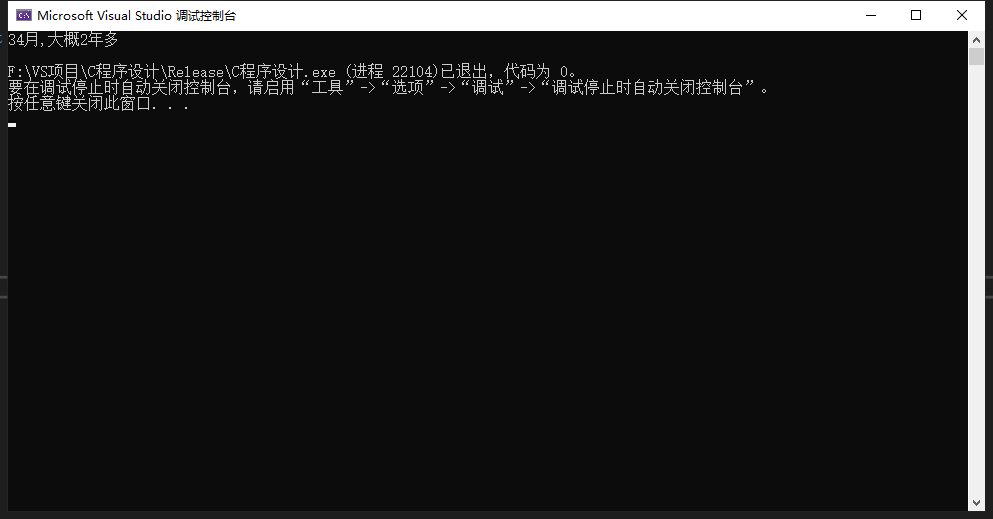

# 题目
>- 1788年，英国人在前往澳大利亚的船只上放了22只绵羊，5只兔子；到如今，澳大利亚的兔子已经泛滥成灾，据说已经有100亿了。假设这5只兔子里有2对公母，像Fibonacci序列一样，每对兔子一个月繁殖1对新兔子；先不考虑兔子寿命问题，请问：多少年后，澳大利亚的兔子就有100亿只了？请用公式计算法和编程法（伪代码）来实现。这个模型其实能较真实地反应繁殖速度，所以你计算的结果是有一定的科学参考价值的。
# 建议
题目出的~~不严谨~~，没有设立兔子成长时间，我只能默认当一个月了，也就是2^n

# 运行结果
